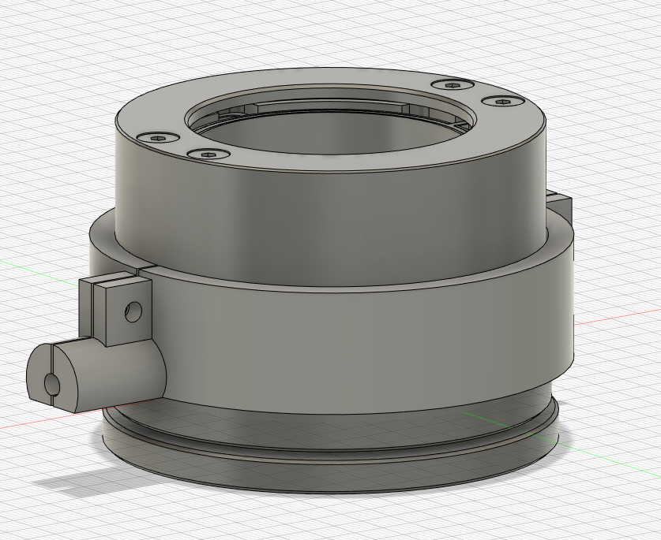
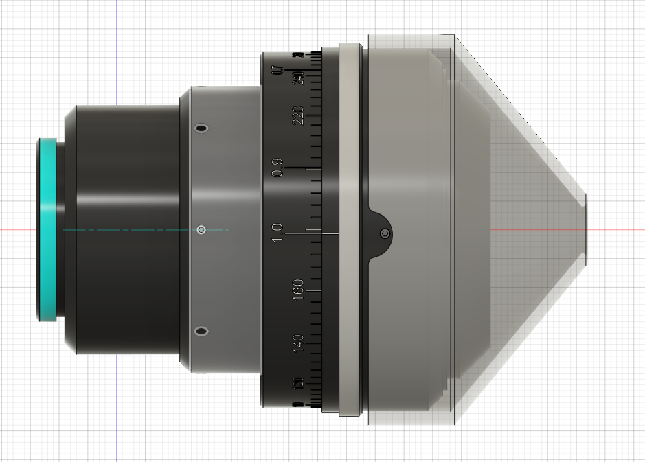

# 3D-printing-models
Collections of 3D printing models created in Reimer lab

---

* **[Wire protector](./WireProtector/) for PI's Piezo [P-726.1 CD](https://www.pi-usa.us/en/products/piezo-flexure-nanopositioners/z-nanofocus-piezo-scanners-for-microscope-lenses/p-726-pifoc-high-load-objective-scanner-200380)**

P-726.1 CD's wire is pretty frigile due to the stiffness of the wire. This protector will keep the wire straight and reduce experimenters's anxiety.
Use three (one near wire, two at the back) M3 screws to faster it around the pizeo. 

---
* **[Cousa lightshield](./Lightshield/) for Pacific Optica's [Cousa objective](https://pacificoptica.com/cousa/)**

With 20mm working distance, it is pretty challegening to do proper light-shiledling even with LED blanker. This lightshiled will help with that. 
The gap at the top edge is to accomendate the setscrew. There are about 3 mm gap between focal plane and the tip of the cone. Reducing the tip if you need more space between.

---
More to come!